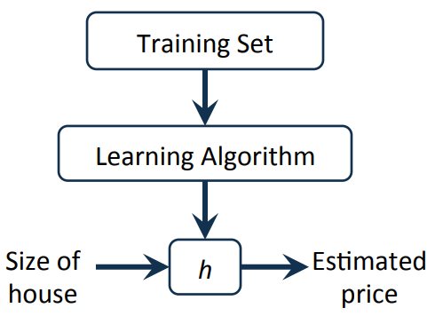

# Linear regression with one variable

### 1 Model representation

- **Hypothesis**:
    $$
    h_\theta(x) = \theta_0 + \theta_1 x
    $$

---

### 2 Cost function

- to find the best parameters

- **Parameters**:
  $$
  \theta_0,\ \theta_1
  $$
  
- **Cost function**: squared error function
  $$
  J(\theta_0,\theta_1) = \frac{1}{2m}\sum_{i=1}^m(h_\theta(x^{(i)} )- y^{(i)})^2
  $$

- **Goal**
  $$
  \underset {\theta_0, \theta_1}{min}\ J(\theta_0, \theta_1)
  $$

---

### 3 Gradient descent

- **outline**
  
  - start with some initial value(like 0)
  
  - keep changing to reduce J until end up at a minimum
    $$
    \theta_j = \theta_j - \alpha\frac{\partial}{\partial\theta_j}J(\theta_0,\theta_1)\\
    (for\ j = 0\ and\ j = 1)\\
    \alpha:learning\ rate
    $$
  
  -  the descent will automatically take smaller steps, though alpha is fixed, because the derivative term will get smaller
  
- **linear regression**
  $$
  \theta_0 = \theta_0 - \alpha\frac{1}{m}\sum_{i=1}^m(h_\theta(x^{(i)} )- y^{(i)})\\
  \theta_1 = \theta_1 - \alpha\frac{1}{m}\sum_{i=1}^m(h_\theta(x^{(i)} )- y^{(i)})*x_i
  $$

  - for linear regression problem, it's usually a bow-shape function, which has only one global optimum

