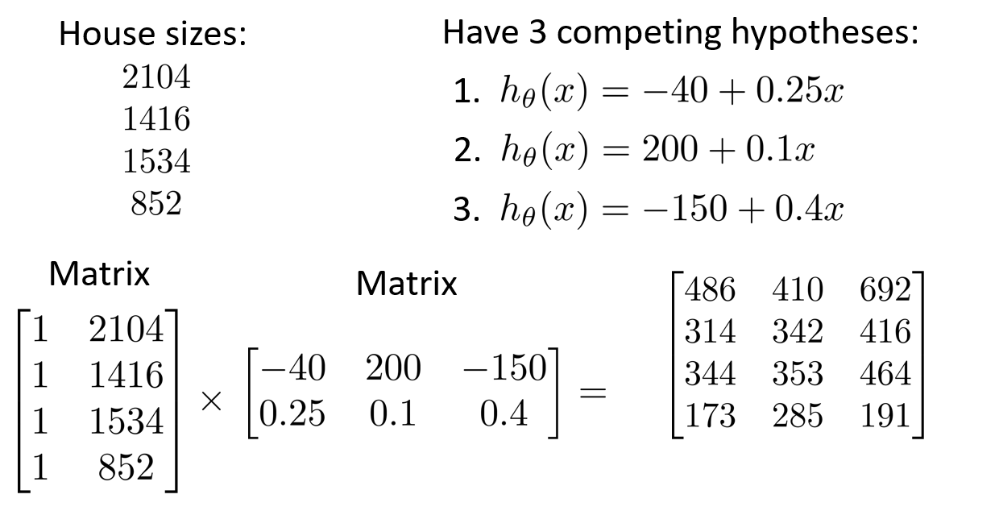

# Linear algebra review

### 1 Matrices and vectors

- **matrix**: rectangular array of numbers
  - Dimension of matrix: rows x columns
- **vector**: an n x 1 matrix

---

### 2 Addition and scalar multiplication

- **matrix addition**
- **scalar multiplication**
- **combination of operands**

---

### 3 Matrix-vector multiplication

- **examples**

- **tips**

  

---

### 4 Matrix multiplication properties

- **associative but not commutative**
- **Identity matrix:** $A\times I_n = I_m\times A$

---

### 5 Inverse and transpose

- **matrix inverse**: only square matrix, $A^{-1}\times A = I$
- **Matrix Transpose**

