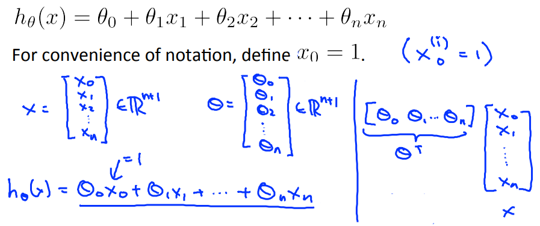
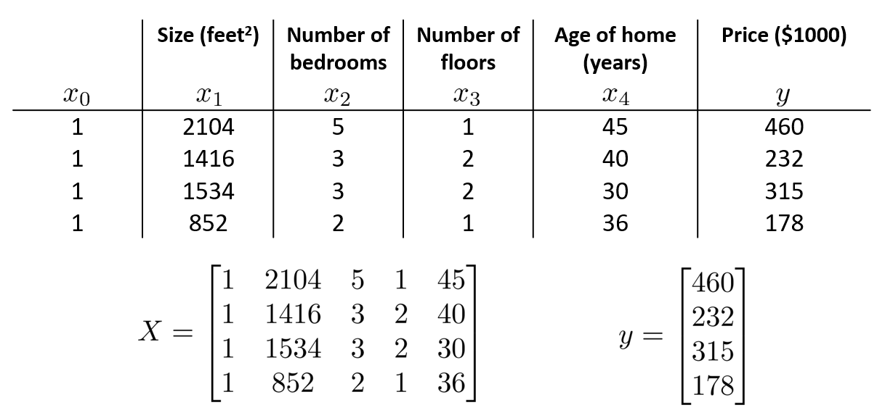
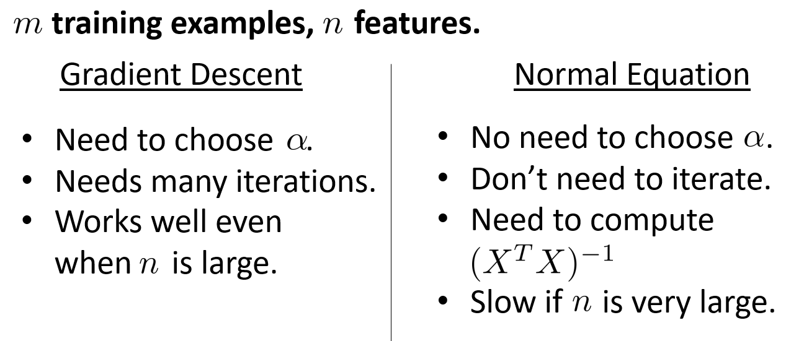

# Linear regression with multiple variables

### 1 Multiple features

- **example**:

  

---

### 2 Gradient descent for multiple variables

- **Hypothesis**:
  $$
  h_\theta(x) = \theta^Tx = \theta_0x_0+\theta_1x_1+\dots+\theta_nx_n\\
  (x_0=1)
  $$

- **Parameters**:
  $$
  \theta_0, \theta_1,\dots,, \theta_n
  $$
  
- **Cost function**:
  $$
  J(\theta_0, \theta_1,\dots,, \theta_n)=\frac{1}{2m}\sum_{i=1}^m(h_\theta(x^{(i)} )- y^{(i)})^2
  $$

- **Gradient descent**:
  $$
  \theta_j:=\theta_j-\alpha\frac{\partial}{\partial\theta_j}J(\theta_0, \theta_1,\dots,, \theta_n)\\
  :=\theta_j - \alpha\frac{1}{m}\sum_{i=1}^m(h_\theta(x^{(i)})-y^{(i)})x_j^{(i)}\\
  (for\ every\ j=0,\dots,n)
  $$
  

---

### 3 Gradient descent in practice

- **Feature Scaling**

  - idea: make sure features are on a *similar scale*
  - get features into approximately a $-1\leq x_i\leq 1 $ range

- **Mean normalization**

  - idea: replace $x_i$ with $x_i-\mu_i$ to make features have *approximately zero mean*

- **example**
  $$
  x_1=size(0-2000\ feet^2)\\x_2=number\ of\ bedrooms(1-5)\\
  then\\
  x_1=\frac{size-1000}{2000}\\x_2=\frac{bedrooms-2}{5}
  $$

- **learning rate**: too small convergence, too large may not converge, so try  many different rate like 0.001, 0.01, 0.1, 1 to see which converge faster

---

### 4 Features and polynomial regression

- **examples**:
  $$
  h_\theta = \theta_0+\theta_1x_1+\theta_2x_2+\theta_3x_3\\
  =\theta_0+\theta_1(size)+\theta_2(size)^2+\theta_3(size)^3
  $$

- **choice of features**:
  $$
  not\ good: h_\theta(x)=\theta_0+\theta_1(size)+\theta_2(size)^2\\
  more\ reasonable: h_\theta(x)=\theta_0+\theta_1(size)+\theta_2\sqrt{(size)}
  $$

- 

---

### 5 Normal equation

- **Normal equation**: **a method to solve for $\theta$ analytically**

  
  $$
  \theta = (X^TX)^{-1}X^Ty
  $$
  - this formula gives the optimal value of $\theta$
  - not need to use features scaling

- **Comparation**

  

- **Normal equation and non-invertibility**
  - in Octave: pinv(X' * X) * X' * y will have a right  answer though non-invertible
  - common cause: 
    - redundant features: x1(size in feet), x2(size in m)
    - too many features: 10 samples with 100 features
